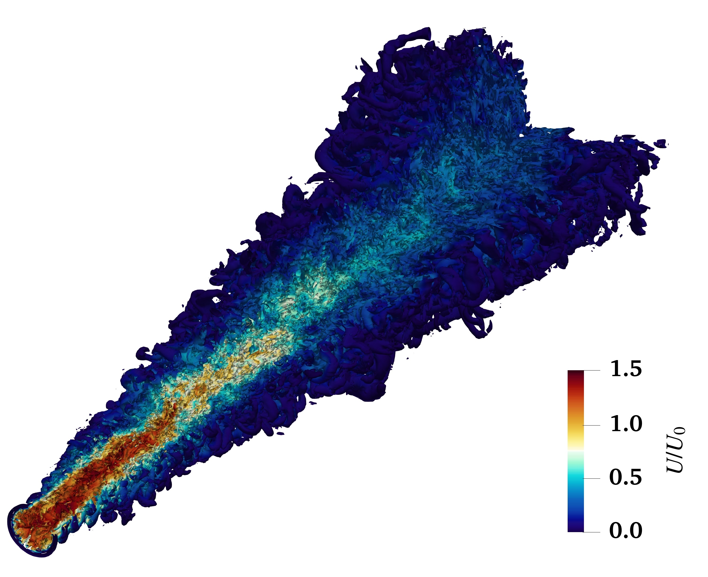
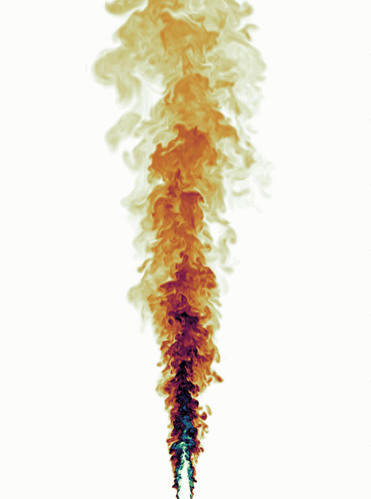

# Hi, I'm Danial Goodarzi

I am a researcher specializing in **fluid mechanics, environmental hydraulics, and computational modeling**, with expertise in both experimental and numerical approaches. My PhD research focuses on **thermal and saline buoyant jets**, exploring the interaction of environmental discharges with ambient.

  <table>
    <tr>
      <td align="center">
        
      </td>
      <td align="center">
        
      </td>
    </tr>
    <tr>
      <td colspan="2" align="center">
        <em>Figure: Cross section of q-criterion isosurfaces at (q = 0.01) (left) and velocity magnitude field for Fr = 15 (right).</em>
      </td>
    </tr>
  </table>

My research methodology draws upon the following tools and techniques:

- **Direct Numerical Simulation (DNS)** and **Large Eddy Simulation (LES)**
- **Laser-Induced Fluorescence (LIF)** and **Particle Image Velocimetry (PIV)**
- **Machine Learning** for developing surrogate and multi-fidelity models

## Current Research Projects

- **Numerical and physical modeling of Desalination Discharges**
- **Surrogate Modeling for Environmental Flows**
- **River Scouring Around Infrastructure**
- **Landslide-Generated Waves**

## Skills & Tools

- **OpenFOAM**, **NEK5000**, **CFD-DEM**, **Gmsh**, **ParaView**
- **Laser-Induced Fluorescence (LIF)** and **Particle Image Velocimetry (PIV)**
- **Python**, **MATLAB**, **C++**, **PyVista**, **NumPy**, **scikit-learn**
