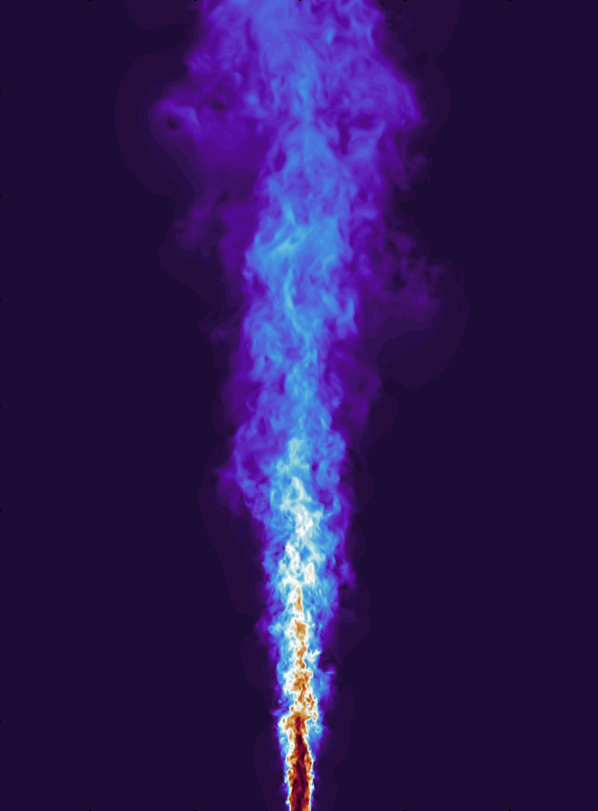

# Hi, I'm Danial Goodarzi

I am a researcher specializing in <strong>fluid mechanics, environmental hydraulics, and computational modeling</strong> with expertise in both experimental and numerical approaches. My PhD research focuses on <strong>thermal and saline buoyant jets</strong> exploring the interaction of environmental discharges with ambient.

  <table>
    <tr>
      <td align="center">
        
      </td>
      <td align="center">
        
      </td>
    </tr>
    <tr>
      <td colspan="2" align="center">
        <em>Figure: Cross section of q-criterion isosurfaces at (q = 0.01) (left) and velocity magnitude field (right).</em>
      </td>
    </tr>
  </table>

  
   
  <em>Figure: Fingering regime observed in the experimental discharge.</em>

My research methodology draws upon the following tools and techniques:

- **Direct Numerical Simulation (DNS)** and **Large Eddy Simulation (LES)**
- **Laser-Induced Fluorescence (LIF)** and **Particle Image Velocimetry (PIV)**
- **Machine Learning** for developing surrogate and multi-fidelity models

## Featured Repositories

- A collection of research materials from my PhD work on thermal and saline [buoyant_jet](https://github.com/HydroCFD/buoyant_jet):
  - Gmsh mesh generation scripts
  - OpenFOAM case setups for RANS and LES
  - NEK5000 case setups for DNS
  - Python post-processing scripts
  - Experimental datasets and visualizations codes

Explore more of my work in the repository above — contributions welcome!

## Current Research Projects

- **Numerical and physical modeling of Desalination Discharges**
- **Surrogate Modeling for Environmental Flows**
- **River Scouring Around Infrastructure**
- **Landslide-Generated Waves**

## Skills & Tools

- **OpenFOAM**, **NEK5000**, **CFD-DEM**, **Gmsh**, **ParaView**
- **Laser-Induced Fluorescence (LIF)** and **Particle Image Velocimetry (PIV)**
- **Python**, **MATLAB**, **C++**, **PyVista**, **NumPy**, **scikit-learn**
